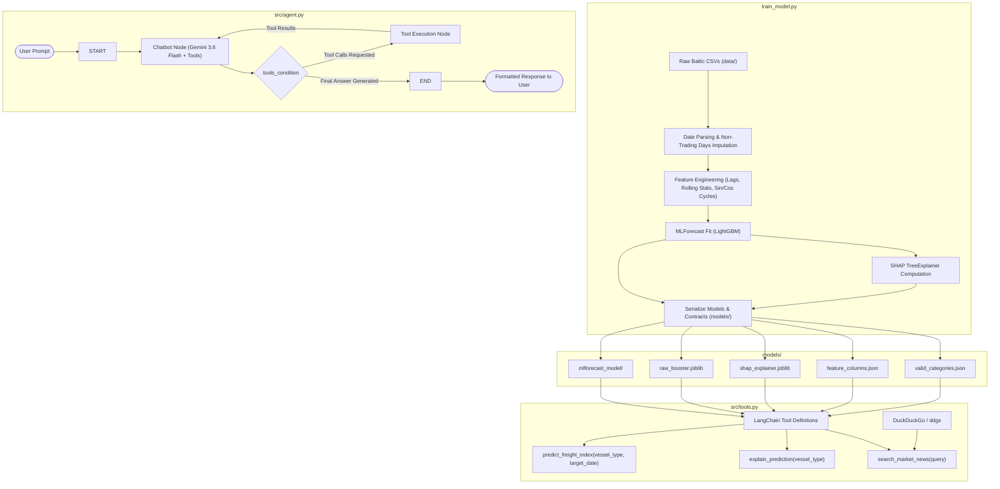

# Comprehensive Project Report: Baltic Freight Market Forecasting & ReAct Agent System

> **Target Audience:** Large Language Models (LLMs), AI Agents, and Machine Learning Engineers maintaining, extending, or querying this codebase.  
> **Repository Root:** `/home/krish/freight_forecast`  
> **Last Audited & Health Checked:** September 2026  
> **Status:** Production-Ready / Fully Verified  

---

## 1. Executive Summary & Domain Context

### 1.1 Project Objective
The **Baltic Freight Market Forecasting System** is a production-grade, hybrid artificial intelligence system designed to predict maritime shipping rates and deliver autonomous, macro-aware freight market intelligence. 

The system operates across two tightly coupled phases:
1. **Phase 1: Quantitative Time-Series ML Forecasting Engine**  
   Utilizes Nixtla's `MLForecast` framework with a `LightGBM` gradient-boosted regressor to generate recursive multi-step forecasts for the Baltic Exchange indices, complete with SHAP (SHapley Additive exPlanations) model explainability.
2. **Phase 2: Autonomous ReAct Decision Agent**  
   Employs a `LangGraph` cyclical ReAct (Reason + Act) agent architecture driven by Google Gemini (`gemini-3.6-flash`) that binds custom forecasting, explainability, and real-time news retrieval tools to answer complex user inquiries.

### 1.2 Maritime Freight Domain Glossary
The Baltic Exchange (headquartered in London) provides daily benchmark assessments for the global maritime dry bulk shipping industry. The system models five primary index series:

| Index / Vessel Class | Typical DWT (Deadweight Tonnage) | Primary Cargoes | Historical Span in Dataset |
| :--- | :--- | :--- | :--- |
| **BDI (Baltic Dry Index)** | Composite Index | Overall dry bulk indicator | 2016-01-18 to 2026-09-16 |
| **Capesize (BCI)** | 100,000 – 400,000+ DWT | Iron ore, coal (long-haul) | 2016-01-18 to 2025-03-31 |
| **Panamax (BPI)** | 65,000 – 100,000 DWT | Grain, coal, bauxite | 2016-01-12 to 2025-03-31 |
| **Supramax (BSI)** | 50,000 – 65,000 DWT | Minor bulks, steel, fertilizers | 2016-01-14 to 2025-03-27 |
| **Handysize (BHSI)** | 15,000 – 40,000 DWT | Forest products, agribulk, cement | 2016-01-19 to 2025-03-31 |

*Note on Market Dynamics:* Dry bulk indices are non-negative under normal physical operations (with rare anomalies during severe crisis periods), highly volatile, subject to seasonal cycles (e.g., Brazilian grain export season, Australian iron ore flows, Chinese Lunar New Year industrial slumps), and sensitive to macro-economic events (weather disruptions, canal bottlenecks, trade policy shifts).

---

## 2. High-Level Architecture

The system bridges statistical time-series forecasting and LLM reasoning through tool-use:



---

## 3. Directory Structure & File Map

```text
/home/krish/freight_forecast/
├── .env                        # Local environment variables (GOOGLE_API_KEY, MODEL_DIR, GEMINI_MODEL)
├── .gitignore                  # Git ignore rules
├── requirements.txt            # Harmonized Python package requirements
├── train_model.py              # Phase 1 ML pipeline: data ingestion, calendar regularization, LightGBM training, SHAP serialization
├── data/                       # Baltic Exchange historical CSV datasets
│   ├── Baltic Capesize Data(2016-2026).csv
│   ├── Baltic Dry Index Data(2016-2026).csv
│   ├── Baltic Handysize Data(2016-2026).csv
│   ├── Baltic Panamax Data (2016-2026).csv
│   └── Baltic Supramax Data(2016-2026).csv
├── models/                     # Serialized artifacts & schema contracts
│   ├── mlforecast_model/       # Fitted MLForecast wrapper directory (models.pkl, ts.pkl)
│   ├── raw_booster.joblib      # Direct LightGBM Booster object
│   ├── shap_explainer.joblib   # Serialized SHAP TreeExplainer instance
│   ├── feature_columns.json    # Exact list of ordered training features
│   └── valid_categories.json   # Canonical vessel categories allowed in predictions
└── src/                        # Phase 2 application source code
    ├── config.py               # Domain constants, news whitelist, default paths
    ├── tools.py                # LangChain tool implementations interfacing with MLForecast and DuckDuckGo
    └── agent.py                # LangGraph ReAct compiled graph and interactive CLI application
```

---

## 4. Phase 1: ML Forecast Pipeline Specification

### 4.1 Data Ingestion & Date Standardization
Each raw CSV contains trading day observations with `Date`, `Price`, `Open`, `High`, `Low`, `Vol.`, and `Change %`. The date formatting in Baltic trade datasets varies by source file:

```python
DATA_FILES = {
    "Capesize": ("Baltic Capesize Data(2016-2026).csv", "%m/%d/%Y"),   # Month-first US format
    "Panamax":  ("Baltic Panamax Data (2016-2026).csv", "%d/%m/%y"),   # 2-digit year European format
    "Supramax": ("Baltic Supramax Data(2016-2026).csv", "%d-%m-%Y"),   # Hyphenated European format
    "Handysize":("Baltic Handysize Data(2016-2026).csv", "%d-%m-%Y"),   # Hyphenated European format
    "BDI":      ("Baltic Dry Index Data(2016-2026).csv", "%d-%m-%Y")    # Hyphenated European format
}
```

> **Critical Historical Invariant:** Using generic or `dayfirst=True` date parsing globally causes severe corruption on `Capesize` data (e.g. `02/12/2025` misparsed as `2025-12-02` instead of `2025-02-12`). Explicit date string format parsing per dataset is mandatory.

### 4.2 Non-Trading Days & Calendar Regularization
Trading does not occur on weekends or exchange holidays. However, `MLForecast` operates on a strict daily frequency (`freq="D"`). If dates contain gaps:
1. Autoregressive lags (e.g. `lag1`) jump across days unevenly (e.g. Monday's `lag1` would erroneously point to Friday instead of Sunday).
2. Prediction horizons based on date math $h = (\text{target\_date} - \text{latest\_date}).\text{days}$ become incompatible with row shifts.

**Solution:** In `train_model.py`, each vessel series is reindexed to an unbroken daily calendar (`full_date_idx = pd.date_range(min, max, freq="D")`), and prices and financial features (`Open`, `High`, `Low`, `y`) are forward-filled (`ffill()`) and backward-filled (`bfill()`). Over weekends and holidays, prices remain constant at the last known close.

### 4.3 Feature Engineering Schema
The training dataset generates 14 predictive features:

1. **Exogenous Financial Indicators (3 features):**
   - `Open`, `High`, `Low`: Latest trading session price boundaries.
2. **Cyclical Date Encodings (4 features):**
   - `month_sin = sin(2 * π * month / 12)`
   - `month_cos = cos(2 * π * month / 12)`
   - `dow_sin = sin(2 * π * dayofweek / 7)`
   - `dow_cos = cos(2 * π * dayofweek / 7)`
3. **Autoregressive Lags (4 features):**
   - `lag1`, `lag7`, `lag14`, `lag30`
4. **Rolling Statistical Transformations (3 features):**
   - `rolling_mean_lag1_window_size7`
   - `rolling_std_lag1_window_size7`
   - `rolling_mean_lag7_window_size14`

### 4.4 Model Architecture & Hyperparameters
- **Library:** `mlforecast.MLForecast`
- **Base Estimator:** `lightgbm.LGBMRegressor`
- **Parameters:**
  ```python
  LGBMRegressor(
      n_estimators=500,
      learning_rate=0.03,
      max_depth=7,
      num_leaves=31,
      subsample=0.8,
      colsample_bytree=0.8,
      random_state=42,
      n_jobs=-1
  )
  ```
- **Target Transformations:** None. Direct index levels are tracked without differencing to maintain absolute index point interpretability.

### 4.5 Artifact Contracts (`models/`)
- `models/mlforecast_model/`: Serialized MLForecast object (`models.pkl` and `ts.pkl`). Contains the trained LightGBM model and time-series metadata (including `ts.last_dates`).
- `models/raw_booster.joblib`: The underlying `lightgbm.Booster` extracted from `fcst.models_["LGBMRegressor"]`.
- `models/shap_explainer.joblib`: Precomputed `shap.TreeExplainer(raw_booster)` instance.
- `models/feature_columns.json`: JSON array of the exact 14 feature names expected by the booster.
- `models/valid_categories.json`: JSON object containing `{"vessel_types": ["BDI", "Capesize", "Handysize", "Panamax", "Supramax"]}`.

---

## 5. Phase 2: Tooling Layer Specification (`src/tools.py`)

The LangChain tools in `src/tools.py` act as the interface between the LLM and the forecasting engine.

### 5.1 Tool 1: `predict_freight_index(vessel_type, target_date)`
- **Input Parameters:**
  - `vessel_type` (str): Case-insensitive name of the vessel class.
  - `target_date` (str): Desired prediction date in `YYYY-MM-DD` format.
- **Validation Pipeline:**
  1. Validates `vessel_type` against `CATEGORY_LOOKUP` (derived from `valid_categories.json`). Rejects invalid classes (e.g. "Tanker", "VLCC").
  2. Parses `target_date` to `datetime`.
  3. Loads `latest_row` via `_get_latest_data(canonical_type)`.
  4. Calculates horizon $h = (\text{target\_date} - \text{latest\_date}).\text{days}$.
  5. Enforces $h > 0$. If $h \le 0$, rejects with clear guidance that `target_date` must be after the latest historical date.
- **Future Exogenous Frame (`X_df`) Construction:**
  Generates a continuous daily range of length $h$ starting at `latest_dt + 1 day`. Forward-fills `Open`, `High`, `Low` from `latest_row`, and generates `month_sin`, `month_cos`, `dow_sin`, `dow_cos` for all $h$ future days.
- **MLForecast Predict Execution:**
  ```python
  preds = fcst.predict(h=h, X_df=X_df, ids=[canonical_type])
  ```
  > **Crucial Invariant:** Passing `ids=[canonical_type]` is required. Because the model was trained across multiple time-series (`BDI`, `Capesize`, etc.), calling `predict()` without `ids` causes `MLForecast` to look for all series in `X_df`, raising `ValueError: Found missing inputs in X_df`.
- **Output:** Formatted string with predicted index points, target date, and horizon distance.

### 5.2 Tool 2: `explain_prediction(vessel_type)`
- **Input Parameters:** `vessel_type` (str).
- **Execution:**
  1. Validates vessel category.
  2. Safely loads `models/shap_explainer.joblib` and `models/feature_columns.json`.
  3. Queries `explainer.model.original_model.feature_importance(importance_type="gain")` to rank features by true predictive split contribution.
  4. Filters top driving features (typically `Open`, `High`, `lag1`, `Low`, `lag14`).
  5. Formulates structural explanation detailing momentum, financial signals, and seasonality.

### 5.3 Tool 3: `search_market_news(query)`
- **Implementation:** `DuckDuckGoSearchResults` from `langchain_community.tools`.
- **Backend:** Backed by the `ddgs` library.
- **Resilience:** Configured with `handle_tool_error=True` to prevent unhandled network or search exceptions from breaking agent flow.
- **Source Governance:** Whitelisted news domains defined in `src/config.py` (`AUTHORIZED_NEWS_DOMAINS`):
  - `lloydslist.com`
  - `freightwaves.com`
  - `joc.com` (Journal of Commerce)
  - `hellenicshippingnews.com`
  - `splash247.com`

---

## 6. Phase 2: Agent Architecture Specification (`src/agent.py`)

### 6.1 LangGraph Architecture
The agent is constructed using LangGraph's cyclical graph pattern:
- **State Schema:**
  ```python
  class State(TypedDict):
      messages: Annotated[list[BaseMessage], add_messages]
  ```
- **Nodes:**
  - `chatbot`: Invokes LLM with bound tools (`predict_freight_index`, `explain_prediction`, `search_market_news`).
  - `tools`: `ToolNode(tools=tools)` which executes requested tool calls.
- **Edges:**
  - `START` $\rightarrow$ `chatbot`
  - `chatbot` $\rightarrow$ `tools_condition` (routes to `tools` if tool calls are requested; otherwise routes to `END`)
  - `tools` $\rightarrow$ `chatbot` (returns tool execution outputs back to the model for final synthesis)

### 6.2 LLM Model Identifier & Environment
- **Active Model String:** `gemini-3.6-flash`
  - Older model identifiers (e.g. `gemini-1.5-flash`, `gemini-2.0-flash`, `gemini-2.5-flash`) are retired/deprecated in the current Google GenAI environment.
  - The model string can be dynamically configured via the `GEMINI_MODEL` environment variable, defaulting to `gemini-3.6-flash`.
- **API Key Configuration:**
  - Loaded automatically from `.env` via `python-dotenv`.
  - If `GOOGLE_API_KEY` is missing or empty, `build_app()` raises a clear, descriptive `ValueError`.

### 6.3 Message Formatting & CLI Loop
In modern `ChatGoogleGenerativeAI` SDK versions, model responses are returned as structured content lists (`[{'type': 'text', 'text': ...}]`).
`src/agent.py` includes `format_message_content()` to extract plain strings from dictionary blocks, ensuring the terminal CLI outputs clean, human-readable text rather than raw JSON structures.

---

## 7. Dependency Harmonization (`requirements.txt`)

Package compatibility has been tested and pinned as follows:

```text
pandas==2.2.3
numpy==1.26.4
scikit-learn==1.5.2
xgboost==2.1.1
lightgbm==4.5.0
mlforecast==0.13.4
shap==0.46.0
langchain==0.3.7
langchain-core<0.4.0
langchain-community<0.4.0
langchain-google-genai>=2.0.4
langgraph==0.2.45
beautifulsoup4==4.12.3
requests==2.32.3
duckduckgo-search==6.3.5
ddgs>=9.16.0
fastapi==0.115.4
uvicorn[standard]==0.32.0
python-dotenv==1.0.1
joblib==1.4.2
pydantic==2.9.2
```

---

## 8. Operational Playbook & Execution Guide

### 8.1 Retraining the ML Forecast Model
To ingest updated CSVs, re-impute calendar gaps, fit the LightGBM regressor, and regenerate all serialized artifacts:
```bash
./venv/bin/python train_model.py
```
*Expected Console Output:*
- Prints loading and cleaning progress per vessel.
- Outputs per-vessel Validation MAE and Overall Mean Validation MAE.
- Re-saves `mlforecast_model`, `raw_booster.joblib`, `shap_explainer.joblib`, `feature_columns.json`, and `valid_categories.json` to `~/freight_forecast/models/`.

### 8.2 Launching the Interactive CLI Agent
To interact with the agent in a conversational terminal interface:
```bash
./venv/bin/python src/agent.py
```

### 8.3 Example Queries Handled by the Agent
1. **Direct Freight Forecast:**
   > *"What is the projected Capesize index for April 15, 2025?"*  
   $\rightarrow$ Agent invokes `predict_freight_index(vessel_type='Capesize', target_date='2025-04-15')` and reports the prediction with horizon context.
2. **Forecast with Explanation:**
   > *"Predict the Panamax freight rate for April 10, 2025 and explain what features are driving this projection."*  
   $\rightarrow$ Agent invokes `predict_freight_index` and `explain_prediction`, providing an integrated financial summary.
3. **Macro-Economic News & Market Correlation:**
   > *"What is the current market sentiment regarding Chinese iron ore demand and how might that impact Baltic Capesize rates?"*  
   $\rightarrow$ Agent invokes `search_market_news(query='Chinese iron ore demand Capesize Baltic')`, retrieves whitelisted market news, and synthesizes an analytical briefing.

---

## 9. Key Instructions & Guardrails for Future LLMs

When modifying, inspecting, or debugging this codebase in the future, adhere to these rules:

1. **Never Change Date Formats Blindly:** `Capesize` data is formatted as `%m/%d/%Y`. If `dayfirst=True` or a generic parser is used, February 12 will parse as December 2, corrupting the time series. Always consult `DATA_FILES` in `train_model.py` and `src/tools.py`.
2. **Never Call `fcst.predict` Without `ids`:** `fcst.predict(h=h, X_df=X_df, ids=[canonical_type])` is mandatory. Omitting `ids` causes `MLForecast` to require exogenous variables for all 5 vessel classes.
3. **Preserve Daily Reindexing (`freq="D"`):** The Baltic datasets do not have weekend trading. Weekends and holidays must remain forward-filled in training data so that lag intervals (1, 7, 14, 30 days) and rolling windows correspond to true calendar days.
4. **Maintain Exogenous Alignment:** If new features are added to `train_model.py`, they must also be added to `future_dates` construction in `src/tools.py:predict_freight_index` and listed in `feature_columns.json`.
5. **Always Use Supported Gemini Models:** In this environment, `gemini-3.6-flash` is active. Deprecated model strings (`gemini-2.0-flash`, `gemini-1.5-flash`) will throw `404 NOT_FOUND` errors.

